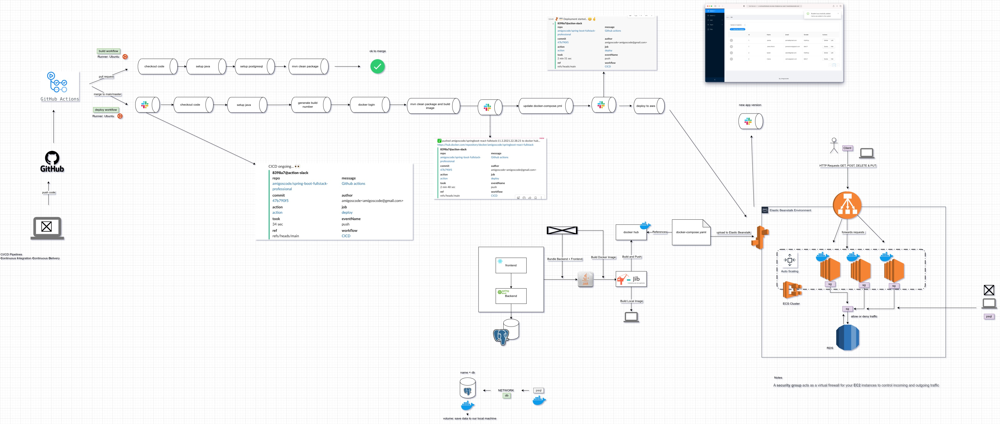
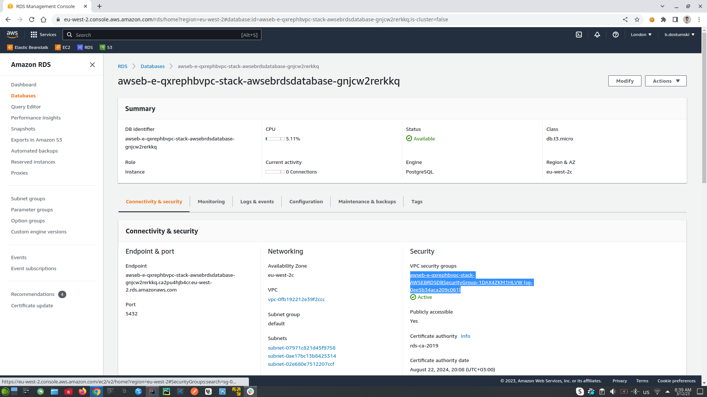
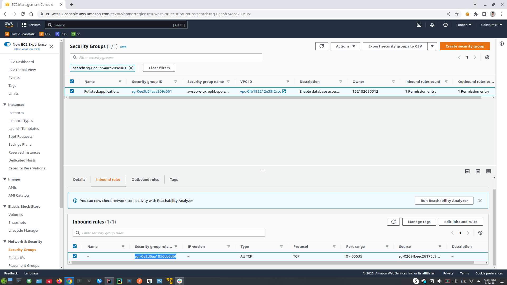
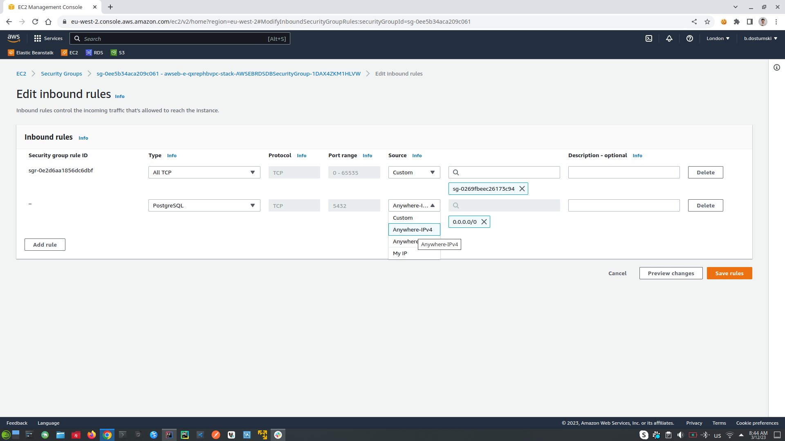
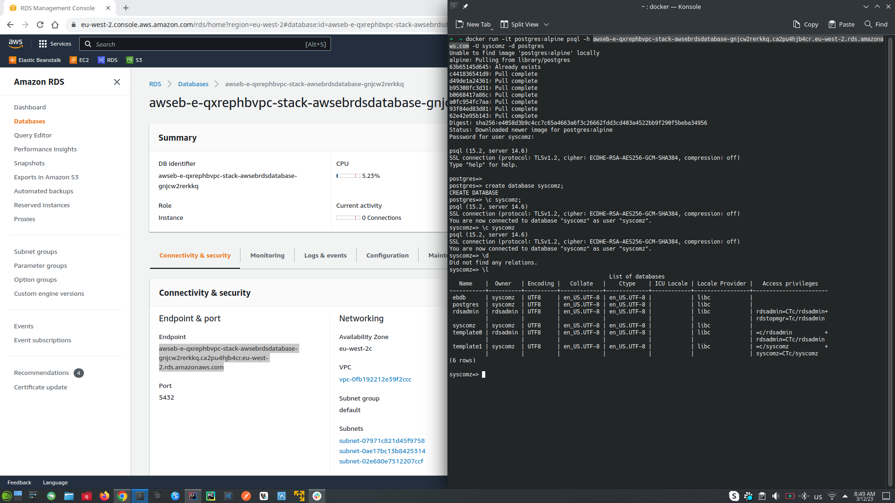
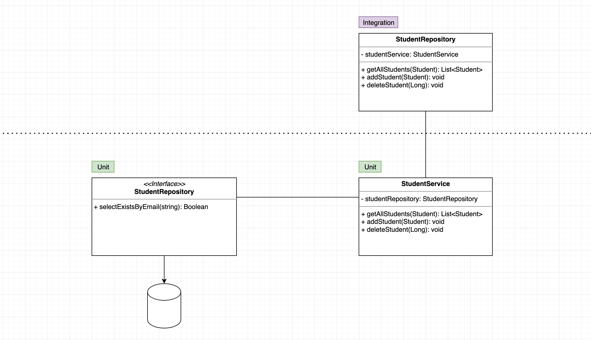

#  Full Stack Spring Boot & React (PROFESSIONAL)

## Software Description
- Describe the software main aim

## Software Architecture Description
- Spring Boot Backend API
- Frontend with React.js Hooks and Functions Components
- Maven Build Tool
- Databases using Postgres on Docker
- Spring Data JPA
- Server and Client Side Error Handling
- Packaging applications for deployment using Docker and Jib
- AWS RDS & Elastic Beanstalk
- Software Deployment Automation with GitHub Actions
- Software Deployment Monitoring with Slack
- Unit and Integration Testing

## Software Architecture


## Links
- [Spring.io](https://spring.io/projects/spring-framework) | The Spring Framework is an application framework and inversion of control container for the Java platform
- [Start.Spring.io](https://start.spring.io/) | Spring Initializer
- [React.js](https://reactjs.org/) | A JavaScript library for building user interfaces
- [Node.js](https://nodejs.org/en/) | Node.js is an open-source, cross-platform JavaScript runtime environment.
- [Create React App with npm](https://www.npmjs.com/package/create-react-app)
- [Create React App](https://github.com/facebook/create-react-app)
- [Ant Design](https://ant.design/) | A design system for enterprise-level products. Create an efficient and enjoyable work experience.
- [Ant Design Use in create-react-app](https://ant.design/docs/react/use-with-create-react-app)
- [React Bootstrap](https://react-bootstrap.github.io/) | By relying entirely on the Bootstrap stylesheet for UI design, React-Bootstrap just works with the thousands of Bootstrap themes you already love.
- [Unfetch](https://github.com/developit/unfetch) | Bare minimum 500b fetch polyfill.
- [Axios](https://github.com/axios/axios) | Promise based HTTP client for the browser and node.js
- [Cross-Origin Resource Sharing (CORS)](https://developer.mozilla.org/en-US/docs/Web/HTTP/CORS)
- [Draw.io](https://app.diagrams.net/)
- [frontend-maven-plugin](https://github.com/eirslett/frontend-maven-plugin) | is used to automate the bundle process between FE and BE projects int one project.
- [maven-resources-plugin](https://maven.apache.org/plugins/maven-resources-plugin/dependency-info.html) | is used to copy **./built** directory from our FE project into **./resources/static** directory from our BE project
- [Docker Hub](https://hub.docker.com/) | Docker containers repository
- [Jib](https://github.com/GoogleContainerTools/jib) | Containerize your Java application
- [Jib FAQs in case of issues](https://github.com/GoogleContainerTools/jib/blob/master/docs/faq.md#what-should-i-do-when-the-registry-responds-with-unauthorized) | If you have any issues with jib refer to this link
- [AWS Registration Page](https://aws.amazon.com/free/?all-free-tier.sort-by=item.additionalFields.SortRank&all-free-tier.sort-order=asc&awsf.Free%20Tier%20Types=*all&awsf.Free%20Tier%20Categories=*all) | Create AWS Account
- [Docker Compose](https://docs.docker.com/compose/) | Compose is a tool for defining and running multi-container Docker application.
- [Docker Compose Versions](https://docs.docker.com/compose/compose-file/compose-file-v3/) | Compose file version 3 reference
- [Terminate Elastic Beanstalk Environment](https://docs.aws.amazon.com/elasticbeanstalk/latest/dg/using-features.terminating.html)
- [Restore Elastic Beanstalk Environment](https://docs.aws.amazon.com/elasticbeanstalk/latest/dg/environment-management-rebuild.html)
- [Docker image Postgres](https://hub.docker.com/_/postgres) | Postgres Image from docker hub repository
- [Mockaroo](https://www.mockaroo.com/)  | Generate fake data based on your production data
- [GitHub](https://github.com/features/actions) | Automate your workflow from idea to production
- [Slack](https://slack.com/) | Slack team messaging system
- [Slack build own apps](https://api.slack.com/apps) | Slack build own app that will automate messaging notifications in CI/CD process
- [Junit 5](https://junit.org/junit5/docs/current/user-guide/#writing-tests-parameterized-tests) | testing framework for Java and the JVM
- [AssertJ](https://assertj.github.io/doc/) | AssertJ
- [H2 Database](https://www.h2database.com/html/main.html) | H2 In-memory Database
- [Failsafe Plugin](https://maven.apache.org/surefire/maven-failsafe-plugin/) | The Failsafe Plugin is designed to run integration tests.
- [Faker](https://github.com/DiUS/java-faker) | Randomly generate fake data, which will be used into integration tests

## Cheat Sheet
- npm -g i npx | global install npx
- npx create-react-app@4.0.3 frontend | choose react version 
- npx create-react-app frontend
- npm start | run react application
- HOST=0.0.0.0 npm start | run react application on specific host
- npm install --save antd@4.13.0 | install dependency with specific version
- npm i -S unfetch | install dependency
- npm install --save @ant-design/icons
- npm run build | build FE project
- ./mvnw | in the root directory of the BE project this command will run **maven** the acronym of **mvnw is maven wrapper**
- ./mvnw clean | remove the **target** folder int our BE application
- ./mvnw clean install | it will clean the project and then at the end will build the JAR file
- docker image ls | show docker images
- docker ps | show running docker images
- ./mvnw jib:dockerBuild -Djib.to.image=fullstack:v1 | Jib create docker image with name **fullstack** and version **v1**
- ./mvnw clean install jib:dockerBuild -Djib.to.image=fullstack:v1 | in case if the **./target** folder is empty and Jar file was not created
- docker run --name fullstack -p 8080:8080 fullstack:v1 | this command says to run docker image with process name fullstack to use port 8080 exposed from port 8080 from the image and name of the image packet is fullstack:v1
- docker ps -a | show all containers (without -a shows just running)
- docker rm -f fullstack | delete docker process with name fullstack
- docker image rm image_name:tag_version | delete docker image 
- docker login | login into docker hub account from your terminal
- ./mvnw clean install jib:build -Djib.to.image=bdostumski/spring-react-fullstack:v1 | maven create **./target** folder use **Jib** to create docker image **bdostumski** is my username into docker hub repository after that is the name of the actual tag.
- ./mvnw clean install jib:build -Djib.to.image=bdostumski/spring-react-fullstack:lates -Djib.to.auth.username=bdostumski -Djib.to.auth.password=my-secret-password | this is same as above but also pass the authentication data
- docker pull bdostumski/spring-react-fullstack | without the version it will pull the latest version of the iamge
- ./mvnw help:active-profiles | shows all active profile
- ./mvnw clean install -P build-frontend -P jib-push-to-dockerhub -Dapp.image.tag=1 | used the two custom created -P profiles (1. bundle FE and BE and build JAR file, 2. create docker images one with tag identity 1 and another **latest** version and push them to docker hub repository)
- ./mvnw clean install -P build-frontend -P jib-push-to-dockerhub -Dapp.image.tag=2 | push to docker hub 
- ./mvnw clean install -P build-frontend -P jib-push-to-local -Dapp.image.tag=latest | create local docker image 
- docker run --rm -p 8080:8080 bdostumski/springboot-react-fullstack:latest | run docker image and when it is close will be removed from ```docker ps -a``` registers
- docker network create db | create network with name **db** on which will communicate docker containers
- docker network rm db | delete docker network with name **db**
- docker run --name db -p 5432:5432 --network=db -v "$PWD:/var/lib/postgresql/data" -e POSTGRES_PASSWORD=password -d postgres:alpine | run docker container with name db expose it on port 5423 use network with name db and volume $PWD (current directory) map it to the /var/lib/postgresql/data which is linux directory on the container use environment variable POSTGRES_PASSWORD start it in detached mode and use alpine version of postgres docker container
- docker run -it --rm --network=db postgres:alpine psql -h db -U postgres | run docker container in **it** interactive mode, **rm** kill the process when the application is closed, use network with name db, use postgres:alpine image, **-h** the host is db this is the name of the other package, **-U** use default user postgres,  

#### NPM
npm install --> install all dependencies described from package.json file, into node_modules directory <br/>
npm install --save \[dependency@version\] --> install new dependency <br/>
npm run build --> build FE application, create build directory <br/>
HOST=0.0.0.0 npm start --> run FE project <br/>

#### Java
java -jar file.jar --> running jar file, from target folder <br/>

#### Maven .mvnw (maven wrapper)
./mvnw clean --> delete target folder <br/>
./mvnw install --> create target folder, maven will use the active profile to build the project, even if the profile includes to build the FE project too. <br/>
./mvnw clean install --> combine above commands, maven will use the active profile to build the project, even if the profile includes to build the FE project too. <br/>

#### Maven, Profiles and Automate FE and BE bundling
https://github.com/eirslett/frontend-maven-plugin --> this plugin use npm to install and build FE project, it is started when maven run install command into active maven profile described into pom.xml file <br/>
https://maven.apache.org/plugins/maven-resources-plugin/plugin-info.html --> automate copy FE build folder into static folder in our BE project, as part of the maven profile and above maven plugin <br/>

#### Docker and Jib
https://github.com/GoogleContainerTools/jib --> Jib builds optimized Docker and OCI (Open Container Initiative) images for our Java applications without Docker daemon. <br/>
<br/>
./mvnw jib:dockerBuild -Djib.to.image=image-name:version --> Jib build LOCAL DOCKER IMAGE from our application <br/>
./mvnw clean install jib:dockerBuild -Djib.to.image=image-name:version --> If the jar file is missing, first create jar file and then build LOCAL DOCKER IMAGE <br/>
<br/>
./mvnw clean install jib:build -Djib.to.image=bdostumski/spring-react-fullstack:v1 --> build jar file, containerized it into docker image and push it to the docker hub repository <br/>
./mvnw clean install jib:build -Djib.to.image=bdostumski/spring-react-fullstack:latest -Djib.to.auth.username=bdostumski -Djib.to.auth.password=**** --> same as above but with login credentials <br/>
<br/>
./mvnw help:active-profiles --> show all active profiles <br/>
<br/>
./mvnw clean install -P bundle-backend-and-frontend -P jib-build-docker-image-and-push-it-to-docker-hub -Dapp.image.tag=2.3 --> build jar file, dockerized it and push it to docker hub repository <br/>
./mvnw clean install -P bundle-backend-and-frontend -P jib-build-local-docker-image -Dapp.image.tag=2.3 --> build jar file, and create docker image <br/>
<br/>
#### Bundle FE and BE locally and build docker image with Jib and push it to the DockerHub repository
./mvnw clean install -P bundle-backend-and-frontend -P jib-build-docker-image-and-push-it-to-docker-hub -Dapp.image.tag=3 -- use -P (for profile) bundle-backend-and-frontend to bundle FE and BE locally, and then run -P (for profile) bundle-backend-and-frontend to use Jib to create docker image and to push it into DockerHub repository, and then set up the version of the docker image -Dapp.image.tag=3 (where app.image.tag is environment variable)<br/>
<br/>
docker login --> login into docker repository <br/>
docker image ls | docker images --> show images in our local machine <br/>
docker ps --> show running containers <br/>
docker ps -a --> show all containers <br/>
docker rm -f --> force the removal of a running containers (uses SIGKILL) <br/>
docker run --name image-name -p 8080:8080 image:version <br/>
docker run --rm --name image-name -p 8080:8080 image:version <br/>
docker pull image:version --> pull image from remove repository <br/>
<br/>
#### Docker and databases
docker network create db <br/>
docker network rm db <br/>
docker run --name db -p 5555:5432 --network=db -v "/path/to/database-dir:/var/lib/postgresql/data" -e POSTGRES_PASSWORD=password -d postgres:alpine // when use $PWD you must be in the directory, that you want to be used for database <br/>
docker run -it --rm --network=db postgres:alpine psql -h db -U postgres  <br/>
docker run -it --rm postgres:alpine psql -h aa9320n4muma7h.celswdmxhcr1.eu-west-1.rds.amazonaws.com -U amigoscode -d postgres // connect to AWS RDS database, after setup AWS Security Group to allow external login to it. -h this is the path to the database that can be found into Elastic Beanstalk, log into environment and click configuration, find database tab copy Endpoint without the port <br/>

## Notes
1. React & Functional Components
   1. React project structure:
      1. Main folder
         - ./node_modules | (Folder) Contains all the dependencies that are needed for an initial working react app
         - ./gitignore | (File) This file specifies intentionally untracked files that Git should ignore
         - ./package.json | (File) This file contains various metadata that is relevant to our project. It specifies the dependencies being used in the project which helps npm setup same environment on different machine for our project.
         - ./README.md | (File) This file can be used to define usage, build instructions, summary of project, etc. It uses markdown markup language to create content.
         - ./yarn.log | (File) This file has same purpose as package-lock.json, it ensures that your package is consistent across various machines by storing the versions of which dependencies are installed with your package.
      2. Public folder
         - ./public | (Folder) Root folder that gets served up as our react app.
         - ./public/favicon.icon | (File) It’s an icon file that is used in index.html as favicon.
         - ./public/index.html | (File) It is the template file which is served up when we run start script to launch our app. It is considered best practice not to create multiple html file in public folder instead use this file and inject react components in this file’s root div container. Other css libraries, etc can be defined in this files.
         - ./public/logo192.png & logo512.png | (Files) These are react logo which is of dimension 192\*192 px and 512\*512 px and is used in the template file (index.html) by default. \[can be removed once you are using your own component\]
         - ./public/manifest.json | (File) It’s used to define our app, mostly contains metadata. Used by mobile phones to add web app to the home-screen of a device. Part of PWA.
         - ./robots.txt | (File) Defines rules for spiders, crawlers and scrapers for accessing your app.
      3. Src folder 
         - ./src | (Folder) In simplest form it’s our React app folder i.e. containing components, tests, css files etc. It’s the mind of our app.
         - ./src/App.css | (File) Contains styles of our React component(App.js)
         - ./src/App.js | (File) This file has very basic react component defined which can be replaced by our own root component
         - ./src/App.test.js | (File) A very basic test(for the default app) is defined in this file which can be replaced by our own tests. \[make use of Jest\]
         - ./src/index.css | (File) Contains styles for general setup of our app.
         - ./src/index.js | (File) This files renders our component and registers service workers(unregistered by default)
         - ./src/logo.svg | (File) Svg file of react logo, being used in component(App.js) by default.
         - ./src/serviceWorker.js | (File) Service worker for pre-caching the scripts files of our react app thereby improving performance.
         - ./src/setupTests.js | (File) As the name suggest this files setups tests and runs them. This file in directly invoked when we run tests from cli(npm run test).[make use of Jest]
   2. Fetching data from BE API with React Unfetch component (alternative is Axios which also is very popular HTTP client)
   3. The React **useState** Hook allows us to track state in a function component. State generally refers to data or properties that need to be tracking in an application.
   4. The **useEffect** Hook allows you to perform side effects in your components. Some examples of side effects are: fetching data, directly updating the DOM, and timers.
2. Bundle FE and BE project into single project. Instead, to run BE and FE separately as single project each other. We can bundle them into a single JAR file with Maven, and start the project from single JAR file.
   1. First we need to map FE application for example localhost:3000 to the home page of the BE application for example localhost:8080, also we need still to have APIs available for example localhost:8080/api/v1/students 
      - **Manual approach (build FE project with ```npm run build``` and copy the files from FE ./build directory into BE ./resources/static directory:** First we need to build FE project ```npm run build``` it will create **build** folder. Copy everything inside **./build** directory and paste it into **./resources/static** directory in our BE project 
      - **Automation approach (to build BE and FE projects into one write at the root directory of our BE project the command ```./mvnw clean install``` which means use maven wrapper, clean the project actually it will delete the target folder, and after that rebuild the project by using the POM.xml configuration file, where actually is our maven automation script) is done by **maven** and **frontend-maven-plugin** plugin into our POM.xml file** with all the necessary configurations. Check the implementation and comments into POM.xml file
      - Generated JAR file from the two approaches mentioned above is placed into **./target** directory ```name-of-the-project.jar```
      - To run the JAR file go to the **./target** directory and write ```java -jar name-of-the-project.jar``` it will run the project itself not from the IDEA.
3. Docker and Jib (Jib is used to bundle JAR file into Docker image)
   1. Jib plugin is used to build docker image from our JAR file (which contains FE and BE together)
   2. Maven Profiles (gives us more flexibility - you can choose which custom profile to start and for example one can bundle FE and BE, another can build local docker image, another ca build docker image and push it to docker hub) this is excellent example of automation build 
4. AWS & Elastic Beanstalk (Deploy our application into AWS)
   1. Elastic Beanstalk (End-to-end web application management service. Which is used for deploying and scaling web applications)
   2. Create docker-compose.yaml file and upload it into Elastic Beanstalk (Elastic Beanstalk Environment will create: load balancer, auto-scaling, into ECS cluster we have EC2 this is the actual virtual server on the cloud, RDS database system)
   3. Elastic Beanstalk (The idea is when the client create request to our application it will go through **load balancer** which will care to load balancing the request into free EC2 virtual server which actually expose our application, the amount of the EC2 servers is configured by auto-scaling set up amount, all the EC2 servers will make requests to our database which is placed into RDS service)
   4. When we want to deploy our application we should choose the file ```./elasticbeanstalk/docker-compose.yaml``` from our local machine
   5. In EC2 tab which is my virtual server will see all the configurations for my application for example (instances, images, EBS (Elastic Block Store), Network & Security, Load Balancing, Auto Scaling)
   6. One approach of deployment is fore example to have BE and FE bundled into single Jar file and to be deployed, another approach for bigger applications is to decouple BE, FE, and other services as separate applications and to be managed by kubernetes to handle the incremental traffic. 
   7. The idea of Elastic Beanstalk is to handle simple applications, if there is a need to have more complex application than we need to check for different approach.
   8. To not be charged from AWS (it is good idea to **terminate** the environment and when it is needed can be **restored** again) links are added above into **Links** section
5. Database and Spring Data JPA
   1. First create docker network with name **db** | docker network create db
   2. On our local machine create folder to store data from our docker container with name **db-data**
   3. Run Postgres docker container in **db-data** folder | docker run --name db -p 5432:5432 --network=db -v "$PWD:/var/lib/postgresql/data" -e POSTGRES_PASSWORD=password -d postgres:alpine
   4. Actually we will have to containers one will be (docker-container-database-name: db) <-> (network-name: db) <-> (docker-container: psql), psql is used to connect to database with name db through network with name db | docker run -it --rm --network=db postgres:alpine psql -h db -U postgres
   5. This docker containers will be used only for testing purposes, in our AWS will use **RDS** database 
   6. Check the application.properties for database configurations
6. Database in ElasticBeanstalk -> AWS RDS
   1. Got to the application environment, click configuration tab and choose database 
   2. On the open windows setup these settings (postgres, version: db.t2.micro this is the smalls database in the AWS)

   3. Create new application-dev.properties file, and make your IDE to use it by adding Environment variables: SPRING_PROFILES_ACTIVE=dev , where dev is equals to dev in application-dev.properties
   4. Databases in AWS are protected by SecurityGroup which means only the instances behind the Load balancer can connect to them, or we can specify specific ip address which also can externally log into our database which is bad practice. (What it is happened, actually is that our clients will log into our application through load balancer, where load balancer will check for free instance of our application will connect it to the client, and the instance of our application will be connected to AWS RDS database which is protected by AWS Firewall Security Group)
      5. Allow external applications to rich our AWS RDS database, find RDS (relational database) into AWS window, click DB instances, after that click into database id, to log into database configurations for the specific database instance. Choose VCP Security Group, log-in, click into Inbound Rules, copy first part of the source code for example: sg-0b8d993d27127ea78. Same Security Group can be seen into EC2 where is the environment instance of our application, check the tab Security and the Security Group id should be the same as that of the RDS database: sg-0b8d993d27127ea78, which means this EC2 instance of the application can communicate with this instance of RDS database.



   6. Setup AWS RDS (relational databases) to allow external applications to rich it. Go to RDS tab, choose DB instance, open the database instance that you want to change, on the Security section click on the link under VPC security groups. In Inbound Rules click Edit Inbound Rules -> click Add Rule setup settings (PostgreSQL, after that choose from where you can connect to your database: from anyware, or from IP) and click Save Rules

   7. Connect to my AWS RDS trough docker example:
      - docker run -it --rm postgres:alpine psql -h aa9320n4muma7h.celswdmxhcr1.eu-west-1.rds.amazonaws.com -U syscomz -d postgres | -h it is the host path to the AWS RDS database without the port, can be found into Environment -> Configuration

7. Deploy new version of the application (first should create new image and push it to the DockerHub, after that should upload docker-compose.yaml into AWS to get the new version from DockerHub)
   0. Remove environment variable from the IDEA SPRING_PROFILES_ACTIVE=dev
   1. First write: docker login, to login into docker
   2. mvn clean install -P bundle-backend-and-frontend -P jib-build-docker-image-and-push-it-to-docker-hub -Dapp.image.tag=3 -- use -P (for profile) bundle-backend-and-frontend to bundle FE and BE locally, and then run -P (for profile) bundle-backend-and-frontend to use Jib to create docker image and to push it into DockerHub repository, and then set up the version of the docker image -Dapp.image.tag=3 (where app.image.tag is environment variable)
   3. To deploy the application into AWS upload docker-compose.yaml file
8. CI/CD Pipelines (Continues Integration Continues Delivery)
   1. CI/CD Steps:
      1. Create code
      2. Push code to GitHub
      3. Execute GitHub Actions (First is for PULL REQUEST, Second is for MERGE TO MAIN)
         1. PULL REQUEST Action (If we push some code and if we raze PULL REQUEST then it will be executed PULL REQUEST Action)
            1. The BUILD WORKFLOW will be triggered which can be run in different VMs like Ubuntu, Windows etc. \*workflow is sequence of steps that allows us to achieve our main goal, it runs on a runner which are VMs
            2. Sequence of steps in BUILD WORKFLOW that will be executed in the runner most likely Ubuntu:
               1. CHECKOUT CODE into our Ubuntu runner - the code is in our GitHub repository
               2. SETUP JAVA 
               3. SETUP POSTGRESQL
               4. MVN CLEAN PACKAGE (which will build, compile and run all the tests)
               5. and if everything is fine will receive message "OK TO MERGE", which will allow us to merge into our main/master branch, if reviewer of the code is OK with it. When we merge into main/master branch it will be executed second step which is MERGE TO MAIN Action
         2. MERGE TO MAIN Action (If we want to merge to main/master branch then it will be executed MERGE REQUEST Action)
            1. The DEPLOYMENT WORKFLOW will be triggered which can be run in different VMs like Ubuntu, Windows etc. \*workflow is sequence of steps that allows us to achieve our main goal, it runs on a runner which are VMs
            2. Sequence of steps into DEPLOYMENT WORKFLOW that will be executed in the runner most likely Ubuntu:
               1. SEND SLACK NOTIFICATION message to the team in this case slack (with message that CI/CD is on going)
               2. CHECKOUT CODE into our Ubuntu runner - the code is in our GitHub repository
               3. SETUP JAVA
               4. GENERATE BUILD NUMBER (version of the application)
               5. DOCKER LOGIN (into DockerHub repository)
               6. MVN CLEAN PACKAGE (which will build, compile and run all the tests), and then BUILD IMAGE (using Jib)
               7. SEND SLACK NOTIFICATION message to the team in this case slack (with message that the images was PUSHED with syntax's bdostumski/image-name:1.0.1)
               8. UPDATE DOCKER-COMPOSE.YAML file into Elastic Beanstalk in AWS
               9. SEND SLACK NOTIFICATION message to the team in this case slack (with message that DEPLOYMENT STARTED this is the deployment for Elastic Beanstalk in AWS)
               10. DEPLOY TO AWS (deployment process is started)
               11. SEND SLACK NOTIFICATION message to the team in this case slack (with message that THE NEW APP IS UP AND RUNNING)
               12. THE APPLICATION IS ALREADY UP
            3. IN CASE OF ERROR INTO DEPLOYMENT WORKFLOW (it will stop to the step where is the error, and will not continue to the next steps)
         3. BUILD WORKFLOW this step is CI (because we merge our new code but do not deploy the new code to the application, we do not create a new build of our application)
         4. DEPLOYMENT FLOW this step is CI/CD (because we merge our new code and deploy the new code to the application, we create a new build of our application)
      4. Slack messaging system
         1. Build own app that will message on deployment process
         2. Click on Settings & Administration -> Manage apps -> Build -> Create App -> From scratch -> Give Name and choose app workspace -> click Create App 
         3. Choose button Incoming Webhooks -> Activate Incoming Webhooks -> Add New Webhook to Workspace \(choose workspace and chanel for messaging\) -> choose Allow 
         4. Copy automatic generated Simple curl request to post to a chanel -> past the code into IntelliJ terminal and will receive message into Slack Hello, World!
         5. Copy Webhook URL and go to your GitHub project go to Settings of the project -> go to Secrets -> Codespaces -> click New Repository Secret -> give random name, and for the value past the copied URL -> Add the secret
         6. Create new Repository Secret and for DockerHub repository to automate the login process -> click agan into New Repository Secret
         7. Create AWS user to perform automated deployments into Elastic Beanstalk
            1. Go to AWS Management Console -> go to your Username -> Security credentials 
               1. Into UserGroups create -> Group \[Give group name, choose policy AdministratorAccess-AWSElasticBeanStalk, click Create Group\]
               2. Into Users create -> create new user for the new group -> click Add User -> give username and click Access key Programmatic access -> click Next Permissions -> into Add user to group choose the group that will be added to this user -> click Next Tags -> do not add anything just click Next:Review -> click Create User 
               3. Copy generated Secret Access ID and Key and paste them into GitHub repository create again into Codespace New Secret give random name for both for example AWS_ACCESS_KEY paste only access key, after that create new secret for the password give name for example AWS_SECRET_ACCESS_KEY and past the secret access key
               4. [Slack messages fix](https://www.svix.com/resources/guides/how-to-get-slack-webhook-url/) Read this to fix Slack messages
            2. Create DEPLOY Workflow Yaml
9. Unit / Integration Testing (testing should start from the repository to the services. Every unit that was tested before should be mocked from the other test. For example, if we test the repository unit, we should mock it in the service tests unit. Except we make integration testing in this case we want the request flow through the system, and make sour that everything is working fine.)

   1. JUnit5 = JUnit Platform + JUnit Jupiter + JUnit Vintage
      1. The JUnit Platform serves as a foundation for launching testing framework on the JVM.
      2. JUnit Jupiter is the combination of the new programming model and extension model for writing test and extensions in JUnit5.
      3. JUnit Vintage provides a TestingEngine for running JUnit3 and JUnit4 based tests on the platform.
   2. AssertJ - is a java library providing a rich set of assertions, truly helpful error messages, improves test code readability. THIS IS BETTER than assertions of JUnit5
   3. Using H2 In-memory Database for Testing purposes 
   4. Integration Tests 
      1. Using Failsafe Plugin (which is part of Plugin Management, in spring-boot-starter-parent), it is designed to run integration tests while the Surefire Plugin is designed to run unit tests.
      2. Integration tests should be tested only positive paths, because all other negative tests are already tested with unit tests